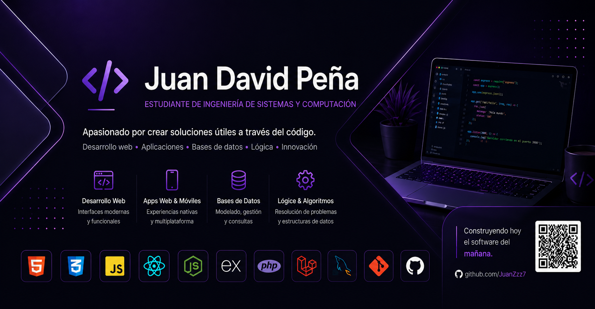

<!-- ======================= BANNER ======================= -->

  

## 👨‍💻 About Me

I am a **Systems and Computer Engineering student** passionate about software development and creating technological solutions.

I am currently strengthening my skills in **web development, backend development, databases, and application architecture**, while working on academic and personal projects that allow me to put theory into practice.

I am especially interested in building applications that are **functional, maintainable, and useful for solving real-world problems**.

- 🎓 Systems and Computer Engineering student
- 💻 Focused on web development
- 🔧 Developing academic and personal projects
- 🗄️ Interested in backend development and databases
- 📚 Continuously learning new technologies
- 🚀 Always looking to improve my development skills

---

## 🛠️ Technologies

### Frontend

  

### Backend

  

### Databases

  

### Tools

  

